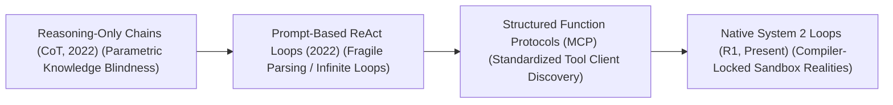
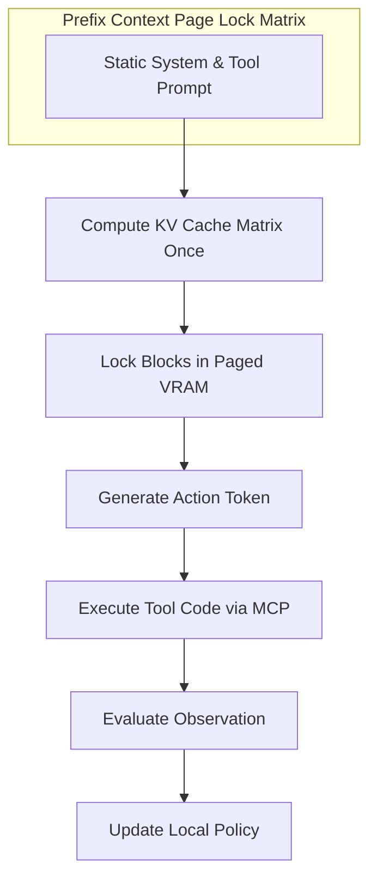

# 🚀 Awesome-ReAct-Framework

  

## 🧠 ReAct (Reasoning + Acting) Framework: History, Progression, Variants, & Applications

The **ReAct (Reasoning + Acting)** framework is a foundational architectural design and prompt-engineering paradigm that enables Large Language Models (LLMs) to seamlessly interleave abstract reasoning traces with concrete, real-world tool execution [INDEX: 12]. Introduced by Yao et al. (Google Research / Princeton) in late 2022 ("ReAct: Synergizing Reasoning and Acting in Language Models"), the framework directly resolved a major structural dichotomy in artificial intelligence [INDEX: 12].

Prior to ReAct, AI agents were split into **Acting-Only Loops** (which interacted dynamically with environments but lacked high-level planning, leading to shortsighted error propagation) and **Reasoning-Only Chains** (such as standard Chain-of-Thought, which could deduce logical steps but remained blind to external, real-time data) [INDEX: 1]. ReAct merged these tracks into a unified **Thought-Action-Observation** loop: the model generates a reasoning thought, dispatches an action command to an external utility, ingests the environment's observation response, and evaluates its next logical milestone [INDEX: 12]. This serves as the core operational engine underpining contemporary autonomous multi-agent tool orchestration networks [INDEX: 12].

---

## 📜 1. The Macro Chronological Evolution

The implementation of unified reasoning and tool execution has transitioned from loose prompt-engineered text wrappers to structured tool protocols, native reinforcement-learned traces, and multi-agent execution enclaves.

| Topic | Description | Year | Paper Link | Details |
| :--- | :--- | :--- | :--- | :--- |
| **The Un-grounded Parametric Chain Era** | The core structural baseline of multi-step AI logic. Heavy parametric memory bias and absolute tool blindness. | 2022 | [Wei, J., et al. (2022)](https://arxiv.org/abs/2201.11903) | [Read More](pages/parametric-chain.md) |
| **The Prompt-Based Text-Wrapper Era** | Merged Chain-of-Thought planning with environment action primitives. Extreme syntax fragility and infinite loop vulnerability. | 2022 | [Yao, S., et al. (2022)](https://arxiv.org/abs/2210.03629) | [Read More](pages/prompt-based-react.md) |
| **The Standardized Client-Server Tool Era** | Ported ReAct into unified, industrial software communication layers like MCP. Decouples language model from tool management. | 2024 | [Anthropic MCP (2024)](https://modelcontextprotocol.io/) | [Read More](pages/mcp-era.md) |
| **The Native Reinforcement-Learned System 2 Search Era** | Internalizes the ReAct loop natively within the model's structural parameter weights via RL. | 2025 | [DeepSeek-R1 (2025)](https://github.com/deepseek-ai/DeepSeek-R1) | [Read More](pages/native-rl.md) |

---

## 🛠️ 2. Core Functional & Algorithmic ReAct Variants

The ReAct framework has diverged into highly specialized agentic routing architectures designed to optimize tool access efficiency and multi-path lookahead search loops.

| Variant | Mechanism | Pros | Year | Paper Link | Details |
| :--- | :--- | :--- | :--- | :--- | :--- |
| **Vanilla ReAct** | Implements a direct, linear sequential loop. | Highly interpretable and straightforward to implement for single-topic informational queries. | 2022 | [Yao, S., et al. (2022)](https://arxiv.org/abs/2210.03629) | [Read More](pages/vanilla-react.md) |
| **Reflexion** | Appends an explicit Self-Reflection memory buffer layer to the ReAct pipeline. | Minimizes repetitive infinite looping by forcing the model to learn from past failures. | 2023 | [Shinn, N., et al. (2023)](https://arxiv.org/abs/2303.11366) | [Read More](pages/reflexion.md) |
| **Plan-and-Solve / Tree-of-Agents** | Generates a comprehensive macro-architectural execution plan upfront, dynamically spawning sub-agents. | Modifies execution matrix to handle complex, long-horizon tasks. | 2023 | [Wang et al. (2023)](https://arxiv.org/abs/2305.04091) | [Read More](pages/plan-and-solve.md) |
| **Reinforcement-Learned Verifiable ReAct** | The model writes executable code scripts and dispatches them straight to sandboxed containers, evaluated by compiler logs. | The absolute standard underpinning advanced coding and math models. | 2025 | [DeepSeek-R1 (2025)](https://github.com/deepseek-ai/DeepSeek-R1) | [Read More](pages/rlvr.md) |

---

## 🗄️ 3. The ReAct Tool-Calling & Caching Matrix

To manage multi-path tree unrolling without hitting VRAM capacity limits, the agentic runtime engine utilizes optimized page-sharing and caching architectures [INDEX: 22].

| Architecture | Profile | Year | Paper Link | Details |
| :--- | :--- | :--- | :--- | :--- |
| **PagedAttention Prefix Cache Locking** | Slashes inference serving costs by locking physical KV memory pages of prefix tokens. | 2023 | [Kwon, W., et al. (2023)](https://arxiv.org/abs/2309.06180) | [Read More](pages/paged-attention.md) |
| **Copy-on-Write Block Routing** | Memory-efficient exploration by sharing identical pointers to parent memory blocks across branches. | 2023 | [Kwon, W., et al. (2023)](https://arxiv.org/abs/2309.06180) | [Read More](pages/copy-on-write.md) |

---

## 🏭 4. Production Engineering Challenges & Hardening Mitigations

Deploying and scaling complex ReAct pipelines across commercial enterprise structures introduces deep context window consumption constraints and critical data security risks [INDEX: 22].

| Challenge | The Problem | Mitigation | Year | Paper Link | Details |
| :--- | :--- | :--- | :--- | :--- | :--- |
| **The Context Inflation Crisis** | Active Key-Value attention cache expands exponentially, saturating GPU memory. | MLA and Hierarchical Parent-Child Chunking. | 2024 | [DeepSeek-V2 (2024)](https://arxiv.org/abs/2405.04434) | [Read More](pages/context-inflation.md) |
| **Context Contamination Threat** | ReAct agents are vulnerable to Indirect Prompt Injection. | Sparse Autoencoders (SAEs) for precise activation steering. | 2023 | [Greshake et al. (2023)](https://arxiv.org/abs/2302.12173) | [Read More](pages/prompt-injection.md) |

---

## 🌐 5. Frontier Real-World AI Industrial Applications

| Application | Description | Year | Paper Link | Details |
| :--- | :--- | :--- | :--- | :--- |
| **Autonomous Software Engineering** | Drives elite automated developer platforms; reading file trees, generating patches, analyzing bash logs recursively. | 2024 | [SWE-agent (2024)](https://arxiv.org/abs/2405.15793) | [Read More](pages/auto-swe.md) |
| **Enterprise Knowledge Auditing** | Processes multi-departmental profiles and automated database extraction, re-mapping table joins automatically. | 2023 | [BIRD (2023)](https://arxiv.org/abs/2305.03111) | [Read More](pages/enterprise-audit.md) |
| **Autonomous E-Commerce Personalization** | Manages large-scale retail order processing, evaluates stock sheets, triggers return shipping securely. | 2023 | [WebArena (2023)](https://arxiv.org/abs/2307.13854) | [Read More](pages/ecommerce.md) |

---

## 📚 References
1. Wei, J., et al. (2022). Chain-of-thought prompting elicits reasoning in large language models. *Advances in Neural Information Processing Systems (NeurIPS)*, 35, 24824-24837 [INDEX: 1].
2. Yao, S., et al. (2022). ReAct: Synergizing reasoning and acting in language models. *arXiv preprint arXiv:2210.03629* [INDEX: 12].
3. Shinn, N., et al. (2023). Reflexion: Language agents with systematic self-reflective learning loops. *arXiv preprint arXiv:2303.11366*.
4. Kwon, W., et al. (2023). Efficient virtual memory management for long-context language model serving loops via pagedattention block routing. *vLLM Open-Source Infrastructure Framework Manual* [INDEX: 22].
5. Anthropic Development Team. (2024). Model Context Protocol (MCP): Standardizing client-server tool abstractions for foundational models. *Anthropic Open-Source Architecture Manifesto* [INDEX: 12].
6. DeepSeek-AI. (2025). DeepSeek-R1: Incentivizing reasoning and verification capability in foundational language transformers via large-scale self-play reinforcement learning loops initialized via curriculum SFT cold-starts. *GitHub Repository Technical Infrastructure Manifesto* [INDEX: 18, 21].

---

To advance this documentation repository, agentic tool blueprint, or MLOps retrieval pipeline, consider exploring these adjacent development pathways:
* Build a **Python script using PyTorch and the Model Context Protocol (MCP) SDK** illustrating how to declare a standard tool schema layout, capture an autonomous function-calling response block, and return execution logs cleanly to a reasoning model client [INDEX: 12].
* Generate a **comprehensive Markdown table** explicitly comparing Pure Chain-of-Thought (CoT), Vanilla ReAct, Reflexion Self-Correction loops, and Native Reinforcement-Learned Search (o1/R1) across mathematical time complexities, GPU VRAM cache inflation parameters, requirements for external parsing scripts, risk of infinite token loops, and downstream cross-domain transfer efficiencies [INDEX: 1, 12, 18, 22].
* Establish an **automated performance profiling suite using Triton** to track the exact computational token-per-second throughput and memory bus latency metrics achieved when compiling a fused prefix-cached paged attention pass directly inside single-pass GPU memory registers [INDEX: 22].

***

**Follow-Up Navigation Matrix:**

Before updating this documentation repository layout, let me know how you would like to proceed by choosing one of the options below:
* I can provide a **complete Python code boilerplate using PyTorch** demonstrating how to write an automated script that calculates an exact preference optimization loss loop configured over a tool-augmented execution dataset [INDEX: 11, 12].
* I can generate a **Markdown matrix table** tracking the default context boundaries, exemplar capacities, and structural pooling layers of the leading foundation open-weight reasoning models [INDEX: 15, 21].
* I can write a detailed technical explanation focusing on **how to train Process-Supervised Reward Models (PRMs)** to accurately identify the exact token step where an active generation pass breaks its targeted tool schema constraints [INDEX: 12, 16].

